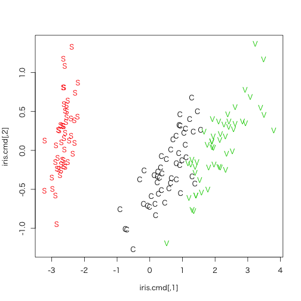

業務でも使える RStudio + github で作る解析環境のひとつの理想形
======================================

## knitr を使えば R のコードと結果を HTML に出力できる

iris データを多次元尺度法に掛けて，色分けして描画する．


```r
iris.dist <- dist(iris[, -5])
iris.cmd <- cmdscale(iris.dist)
plot(iris.cmd, type = "n")
iris.lab <- factor(c(rep("S", 50), rep("C", 50), rep("V", 50)))
text(iris.cmd, labels = iris.lab, col = unclass(iris.lab))
```

 

